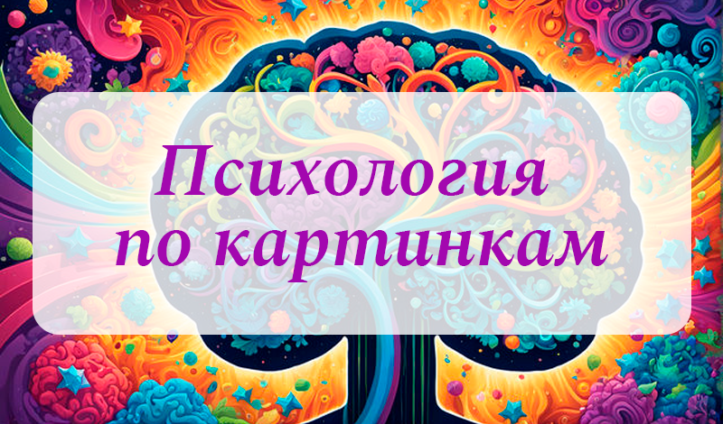

<h3>Психологический тест по картинкам на construct3.</h3>

<h4>Об игре</h4>

Погрузитесь в увлекательное путешествие самопознания с помощью нашей игры "Психология по картинкам". Это захватывающее приключение, где каждый клик на картинке раскрывает новые аспекты вашей личности. 
Узнайте больше о себе и окружающих, используя уникальный метод анализа особенностей личности через картинки. Особенности: 
- Увлекательный опыт: Исследуйте уникальные аспекты вашей личности, решая интересные задания и анализируя предпочтения в картинках. - Личностный анализ: Получите инсайты о своей личности и понимание своих предпочтений через анализ выбранных вами картинок. -
- Развлекательное обучение: Обучайтесь о психологии и самопознании, играя в увлекательную и познавательную игру. - Интерактивные задания: Выполняйте задания, которые помогут вам лучше понять себя и окружающих, используя только картинки. Играйте в "Психологию по Картинкам"
- сейчас и откройте новые горизонты самопонимания!

<h4>Как играть</h4>

1. Выбор картинки: Начните игру с выбора картинки, которая наиболее точно отражает ваше настроение или предпочтения. 2. Появление ответа: После выбора картинки вы сразу получите уникальный ответ,
2. который анализирует ваш выбор и раскрывает новые аспекты вашей личности. 3. Размышления и понимание: После получения ответа размышляйте над ним и понимайте, как выбранная вами картинка связана с
3. вашим характером и предпочтениями. 4. Играйте снова: Продолжайте играть, выбирая новые картинки и получая новые ответы, чтобы расширить свое понимание о себе и окружающем мире.

